# Lawrie · Pixel Carrot Rabbit Desktop Pet 🐰🥕

English | [中文](README.md)

[](https://github.com/SANABI-LL/Lawrie/releases/latest)
[](https://github.com/SANABI-LL/Lawrie/releases)
[](LICENSE)
[](#how-to-run)

A **custom pixel-art desktop pet** built with [pet-forge](https://github.com/SANABI-LL/pet-forge-2) SVG workflow — a carrot-loving rabbit. Each state is a **self-contained `.svg.html`** file (inline SVG + CSS + JS, zero dependencies, double-click to run) with pixel-perfect, hard-edged, frame-skipping pixel-art style.

> This repository is a development archive where you can track the project's progress.

**⬇️ Quick Start**: From [Releases](https://github.com/SANABI-LL/Lawrie/releases/latest) — Windows: download `Lawrie-*-win-x64.exe` and double-click; macOS (Apple Silicon): download `Lawrie-*-arm64.dmg` and drag to Applications.

## State Overview

<table>
  <tr>
    <td align="center">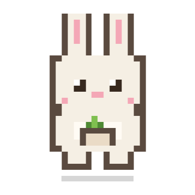<br><sub>idle</sub></td>
    <td align="center">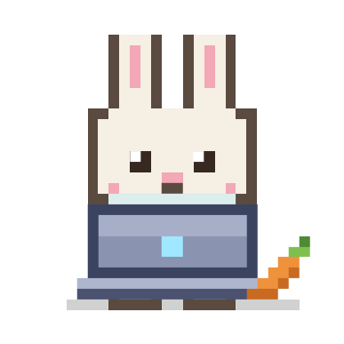<br><sub>typing</sub></td>
    <td align="center">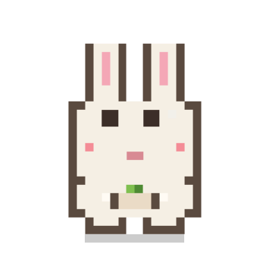<br><sub>thinking</sub></td>
    <td align="center">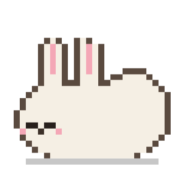<br><sub>sleeping</sub></td>
  </tr>
  <tr>
    <td align="center">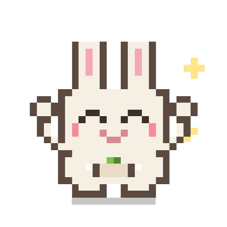<br><sub>happy</sub></td>
    <td align="center">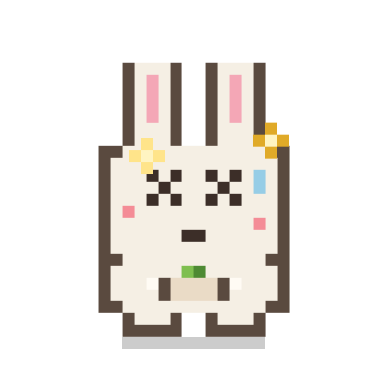<br><sub>error</sub></td>
    <td align="center">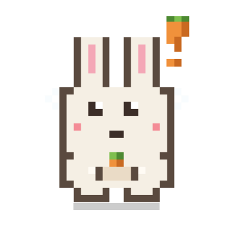<br><sub>notification</sub></td>
    <td align="center"><br><sub>carrying</sub></td>
  </tr>
  <tr>
    <td align="center">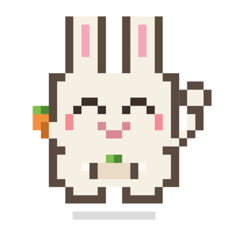<br><sub>greeting</sub></td>
    <td align="center">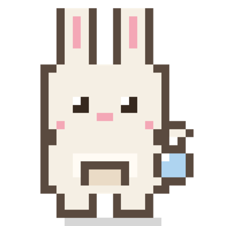<br><sub>searching</sub></td>
    <td align="center">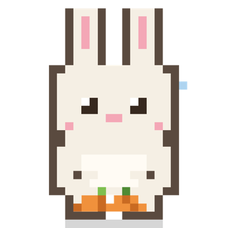<br><sub>compacting</sub></td>
    <td align="center">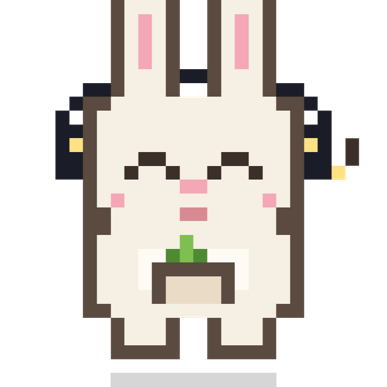<br><sub>chilling</sub></td>
  </tr>
</table>

<sub>Static previews (`previews/`). To see animations: visit the overview page after enabling GitHub Pages, or download any `rabbit-*.svg.html` file and open it in a browser.</sub>

## One-Command Setup for Claude Code

Enter these two lines in Claude Code:

```
/plugin marketplace add SANABI-LL/Lawrie
/plugin install lawrie-pet@lawrie
```

After installation, **restart Claude Code** and the rabbit will automatically appear, changing states as you work — no configuration needed.

- First run will auto-download the widget (70–90MB, one-time), then the rabbit pops up and waves hello.
- To uninstall: `/plugin uninstall lawrie-pet@lawrie`, hooks are removed cleanly.
- **Windows / macOS (Apple Silicon)** both auto-launch; see "Manual Setup / Other Platforms" below for Linux.

## Live Preview

After enabling GitHub Pages, view all animated states at once:
**https://sanabi-ll.github.io/Lawrie/**

Or download any `rabbit-*.svg.html` file and open it in a browser.

## Character Design

- **Form**: Standing full-body pixel rabbit (tall ears + pink inner ears + round body + short legs)
- **Color DNA**: Warm white fur `#F5EFE4` / Dark cocoa outline `#5A4A3F` / Pink inner ear `#F4A7B6` / Dark cocoa eyes
- **Motif**: **Carrot lover** — carrots are hidden in every state (in pocket / munching / dreaming / thought bubble shaped like carrot)
- **Canvas**: 28×28 pixels, scaled with `image-rendering: pixelated`

## State Progress

| State | File | Animation | Status |
|---|---|---|---|
| idle | `rabbit-idle.svg.html` | Breathing + Blinking + Munching carrot | ✅ |
| typing | `rabbit-typing.svg.html` | Laptop back + Eye scanning + "da" floating + Side carrot | ✅ |
| thinking | `rabbit-thinking-v2.svg.html` | Eyes up + "..." + Lightbulb moment | ✅ |
| sleeping | `rabbit-sleeping.svg.html` | Lying down + Licking + Carrot dream bubble | ✅ |
| happy | `rabbit-happy.svg.html` | Jumping + Cheering + Hands up + Stars | ✅ |
| error | `rabbit-error-v2.svg.html` | XX dizzy eyes + Stars circling + Glitch offset | ✅ |
| notification | `rabbit-notification.svg.html` | Staring + Ping waves + Flashing "!" + Orange top peeking | ✅ |
| carrying | `rabbit-carrying.svg.html` | Team lead: Sunglasses + Fist up + Carrot sword + Swag + Scan beam | ✅ |
| greeting | `rabbit-greeting.svg.html` | Waving paw + Carrot salute + Light hopping | ✅ |
| searching | `rabbit-searching.svg.html` | Magnifying glass ground sweep + Carrot flash in lens + Pacing | ✅ |
| compacting | `rabbit-compacting.svg.html` | Pressing carrot pile → Tied dried-carrot brick ✨ | ✅ |
| chilling | `rabbit-chilling.svg.html` | Headphones + Head bobbing + Floating notes (manual easter egg) | ✅ |

**All 12 states complete** 🎉: the base 8-state set + v1.1 additions greeting / searching / compacting / chilling.

> "carrying" represents a team leader carrying responsibilities — the carrot is their weapon, wearing sunglasses with swagger.

## Project Milestones

- [x] ① Character design (topology + pixel style + carrot motif)
- [x] ② State animations (8/8 recommended states complete)
- [x] ③ Desktop widget runtime (`runtime/widget/` custom Electron widget + `theme.json` state registry + local port 4747 listening to Claude events)
- [x] ④ Production deployment (packaged executable, auto-launches with Claude Code session, real-time state switching)

## Runtime / Desktop Widget

`runtime/widget/` is a minimalist custom Electron widget (transparent, always-on-top, native dragging, corner-resize, size memory) that turns the 12 `.svg.html` states into a **desktop pet that reacts to Claude Code in real-time**.

**How to Run**:

```bash
cd runtime/widget
npm install
npm start          # Sync state assets and launch widget (dev mode)
# or npm run dist   # Package as desktop executable
```

> **Platform Note**: **Windows** (pre-packaged exe) and **macOS (Apple Silicon)** (pre-packaged dmg/zip; `LSUIElement` keeps it out of the Dock, visible across all Spaces) are both officially supported — the plugin auto-downloads and launches per platform.
> **Linux** users can run from source: `npm start` directly shows the widget (Electron is cross-platform); to integrate with Claude Code, set `hooks.example.json` `SessionStart` launch command to your executable path `/path/lawrie &` (other `curl` lines work cross-platform). To package for linux, add a `linux` target alongside `build.mac` in `runtime/widget/package.json` then run `npm run dist`.

**Real-Time Integration**: The widget runs a local HTTP server at `127.0.0.1:4747`, `GET /<state-name>` switches the rabbit to that state. Through Claude Code's [hooks](https://docs.claude.com/en/docs/claude-code/hooks), lifecycle events are mapped to requests to this port, so as Claude works, the rabbit automatically changes expressions:

| Claude Code Event | Rabbit State |
|---|---|
| SessionStart | greeting (launches widget if not running) |
| UserPromptSubmit | thinking |
| PreToolUse (Grep/Glob/WebSearch/WebFetch) | searching |
| Pre/PostToolUse (other tools) | typing |
| PostToolUseFailure | error |
| PreCompact (context compaction) | compacting |
| SubagentStart / Stop | carrying / typing |
| Notification, Stop (finished) | notification |
| Manual `curl 127.0.0.1:4747/chilling` | chilling easter egg 🎧 |

<details>
<summary><b>Manual Setup / Other Platforms</b> (expand for non-plugin setup · anyone can follow)</summary>

> Most people can use the "One-Command Setup" above. This is for those who don't want plugins, or macOS/Linux users.

Hook configuration template is in [`runtime/widget/hooks.example.json`](runtime/widget/hooks.example.json). Here's the complete setup (Windows):

> **macOS users**: same steps, two differences — in Step 1 download `Lawrie-*-arm64.dmg` and drag Lawrie into Applications; in Step 3 replace the `SessionStart` command with
> `curl -s -m 1 http://127.0.0.1:4747/greeting || open -a "/Applications/Lawrie.app" || exit 0` (everything else identical).

**Step 1: Place the rabbit in a fixed folder**

- Download `Lawrie-1.0.0-win-x64.exe` from [Releases](https://github.com/SANABI-LL/Lawrie/releases) (or build your own with `npm run dist`).
- Create a folder called `Lawrie` in `C:\Users\YourUsername\`, drag the exe in, and **rename it to `Lawrie.exe`** (remove version number for easier path reference).
- Don't put it in "Downloads" — files there can be auto-deleted.

> Don't know your username? Open File Explorer, type `%USERPROFILE%` in the address bar and press Enter. The folder name is your username.

**Step 2: Locate Claude Code's settings file**

- Open File Explorer, type `%USERPROFILE%\.claude` in the address bar and press Enter.
- Check if `settings.json` exists: if yes, open it with Notepad; if not, create a new text file and rename it to `settings.json` (note the `.json` extension, not `.txt`).

**Step 3: Paste this into `settings.json`**

If your `settings.json` is empty, paste the entire block below, then **change one thing**: replace both instances of `YourUsername` with your actual username.

```json
{
  "hooks": {
    "SessionStart":       [{ "matcher": "", "hooks": [{ "type": "command", "command": "curl -s -m 1 http://127.0.0.1:4747/greeting || explorer.exe \"C:\\Users\\YourUsername\\Lawrie\\Lawrie.exe\" || exit 0" }] }],
    "UserPromptSubmit":   [{ "matcher": "", "hooks": [{ "type": "command", "command": "curl -s -m 2 http://127.0.0.1:4747/thinking || exit 0" }] }],
    "PreToolUse":         [
      { "matcher": "Grep|Glob|WebSearch|WebFetch", "hooks": [{ "type": "command", "command": "curl -s -m 2 http://127.0.0.1:4747/searching || exit 0" }] },
      { "matcher": "^(?!(Grep|Glob|WebSearch|WebFetch)$).*", "hooks": [{ "type": "command", "command": "curl -s -m 2 http://127.0.0.1:4747/typing || exit 0" }] }
    ],
    "PostToolUse":        [{ "matcher": "", "hooks": [{ "type": "command", "command": "curl -s -m 2 http://127.0.0.1:4747/typing || exit 0" }] }],
    "PostToolUseFailure": [{ "matcher": "", "hooks": [{ "type": "command", "command": "curl -s -m 2 http://127.0.0.1:4747/error || exit 0" }] }],
    "Notification":       [{ "matcher": "", "hooks": [{ "type": "command", "command": "curl -s -m 2 http://127.0.0.1:4747/notification || exit 0" }] }],
    "PreCompact":         [{ "matcher": "", "hooks": [{ "type": "command", "command": "curl -s -m 2 http://127.0.0.1:4747/compacting || exit 0" }] }],
    "SubagentStart":      [{ "matcher": "", "hooks": [{ "type": "command", "command": "curl -s -m 2 http://127.0.0.1:4747/carrying || exit 0" }] }],
    "SubagentStop":       [{ "matcher": "", "hooks": [{ "type": "command", "command": "curl -s -m 2 http://127.0.0.1:4747/typing || exit 0" }] }],
    "Stop":               [{ "matcher": "", "hooks": [{ "type": "command", "command": "curl -s -m 2 http://127.0.0.1:4747/notification || exit 0" }] }]
  }
}
```

> ⚠️ **Two common pitfalls**:
> 1. **Use double backslashes in paths**. In JSON, `\` is a special character, so paths must use `C:\\Users\\YourUsername\\Lawrie\\Lawrie.exe` (double backslashes). Copy the format above.
> 2. **If `settings.json` already has content** (like `"model"`, `"theme"`), don't overwrite — add the `"hooks": { ... }` block inside the outermost `{ }`, separated by a comma. When in doubt, backup the original first.

**Step 4: Restart Claude Code**

After saving, **close and reopen Claude Code** (hooks only activate in new sessions). When a new session starts, the rabbit will pop up automatically (SessionStart launches it), then change states as you work.

**Step 5: Verify**

- Send a message → rabbit enters thinking (eyes up).
- Run a tool/edit a file → switches to typing (munching carrot).
- Error occurs → error with dizzy eyes. If all match, it's working.

> Want to see the rabbit standalone? Double-click `Lawrie.exe` to see it on desktop (drag to move, corner-resize, `Ctrl+Q` to quit). In `idle` state, eyes follow your mouse (±1 pixel).

**Troubleshooting**:

- Rabbit doesn't appear → Double-click `Lawrie.exe` manually to confirm it opens; if it does, the path in Step 1 is wrong.
- Rabbit opens but doesn't change states → Likely `settings.json` format error (missing comma/bracket). Paste content into any "JSON validator" website to check.
- States jumping randomly → Confirm port 4747 isn't occupied by another program.

</details>

## Development Notes

- Character design uses a 28×28 ASCII `SPRITE` character map, JS reads the map and renders 1×1 `<rect>` elements (`.` transparent, `O` outline, `W` fur, `P` pink, `B` belly). Change the map to change the design.
- Character consistency maintained by reusing the same sprite map across states.
- `_archive/` contains early/replaced versions (Shiba Inu trial, thinking/error v1) for reference.

## License

Dual licensing:

- **Code** (`runtime/widget/` widget, scripts, `.svg.html` technical structure, configuration) — [MIT](LICENSE). Feel free to learn, modify, and create your own desktop pet.
- **Lawrie Character** (pixel design, color scheme, carrot motif, visual design of `rabbit-*.svg.html`) — © 2026 SANABI-LL, **all rights reserved**, see [ART-LICENSE.md](ART-LICENSE.md). You can run it and learn techniques, but please don't copy this rabbit for redistribution.

Want to create your own desktop pet? Use the [method](https://github.com/SANABI-LL/pet-forge-2), not this rabbit — make a character with your own visual DNA, which is the spirit of pet-forge.

---

Made with [Claude Code](https://claude.com/claude-code) + pet-forge skill.
